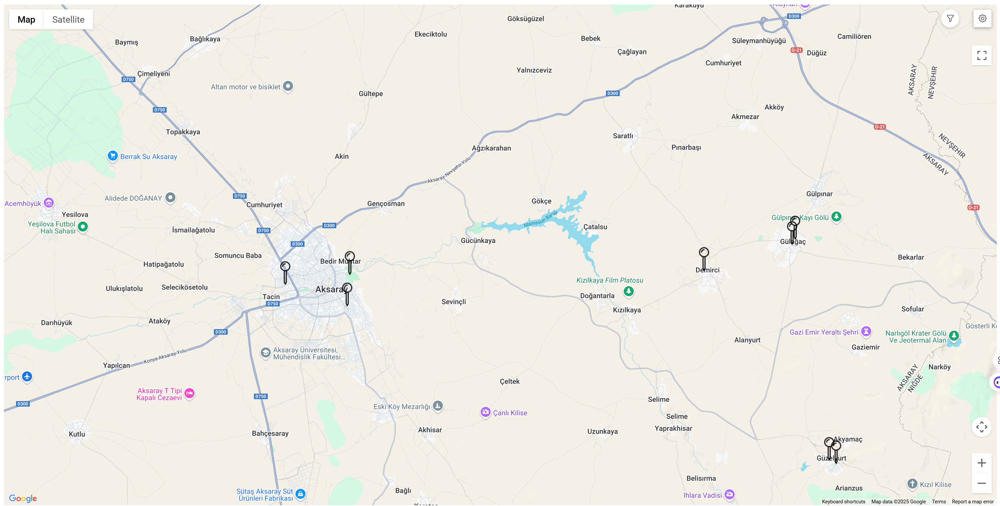
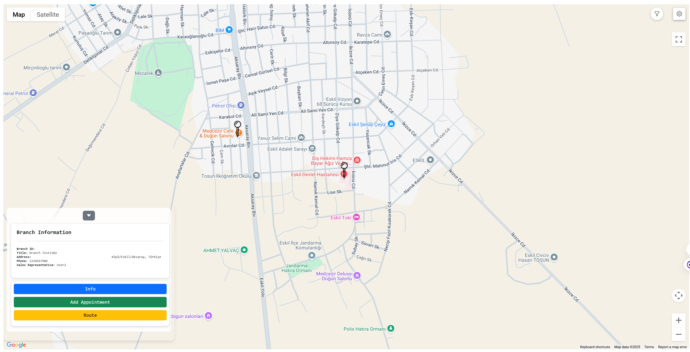
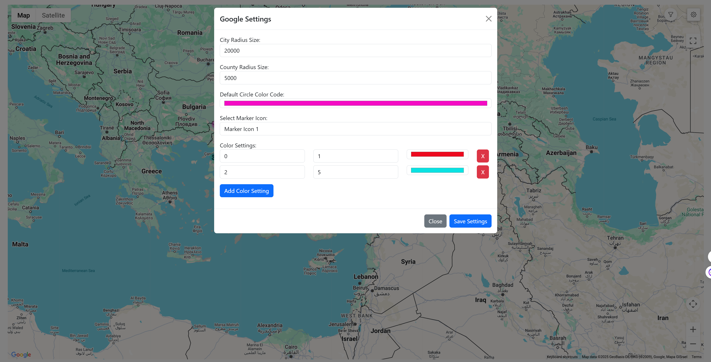

# Google Maps Filter & Marker

Bu proje, Google Maps API kullanarak **şehir ve ilçe bazlı daire (circle)** gösterimi, şube (branch) konumlarının **marker** (işaretçi) olarak haritada listelenmesi ve **çeşitli filtrelerle** (şehir, ilçe, kullanıcı, randevu durumu vb.) dinamik kontrol sağlama üzerine odaklanır.

## İçindekiler

- [Özellikler](#özellikler)
- [Kod Yapısı](#kod-yapısı)
- [Veri Yapısı](#veri-yapısı)
- [Kurulum ve Çalıştırma](#kurulum-ve-çalıştırma)
- [Kullanım Akışı](#kullanım-akışı)
  - [initMap Metodu](#1-initmap-metodu)
  - [Zoom Mantığı](#2-zoom-mantığı)
  - [Filtreler](#3-filtreler)
  - [Marker ve Branch Detayları](#4-marker-ve-branch-detayları)
- [Ayarlar (Settings)](#ayarlar-settings)
- [Özelleştirme İpuçları](#özelleştirme-ipuçları)
- [Katkıda Bulunma](#katkıda-bulunma)
- [Lisans](#lisans)

---

## Özellikler

1. **Şehir ve İlçe Bazlı Haritalama**  
   - Haritada şehirleri ve ilçeleri **daire (circle)** halinde gösterir.  
   - Dairelerin boyutu ve rengi, sahip olduğu “şube” sayısına göre **dinamik** olarak ayarlanır.

2. **Branch (Şube) Marker’ları**  
   - Zoom seviyesi belirli bir düzeye geldiğinde şube (branch) konumları **marker** olarak görüntülenir.  
   - Marker tıklandığında şubenin adresi, telefonu ve atanan kullanıcı(lar) gibi bilgiler bir panelde gösterilir.

3. **Filtreleme Mekanizması**  
   - Şehir, ilçe, kullanıcı ve randevu (visited/unvisited/all) durumuna göre şubeleri filtreleyebilirsiniz.  
   - Tarih aralığı girerek belirli dönemde ziyaret edilmiş/edilmemiş şubeleri vurgulayabilirsiniz.

4. **Dinamik Arayüz**  
   - Zoom değişikliklerinde harita otomatik olarak şehir dairelerinden ilçe dairelerine, oradan da şube marker’larına geçiş yapar.  
   - Renk skalası (min–max şube sayısı aralıklarına karşılık gelen renk ayarları) değiştirilebilir.

  


  


  


  


  


  

---

## Kod Yapısı

Kod, tek bir büyük fonksiyon modülü (IIFE) içerisinde tanımlanmıştır:

```js
Google.MapObject = (function () {
    // ... değişkenler, fonksiyonlar ...
    return GMaps;
})(window);
```

- **`GMaps`** objesi, `initMap` gibi ana fonksiyonları **dış dünyaya** açar.  
- İçeride şehir/ilçe daireleri, marker yönetimi ve filtre mantığı gibi parçalar vardır.

### Öne Çıkan Fonksiyonlar

- **`initMap(...)`**  
  Haritayı oluşturup tüm listeleri (userList, cityList, branchList vb.) bağlar ve **ilk ayarları** yapar.
- **`createCityCircles`** ve **`createCountyCircles`**  
  Şehir veya ilçe bazlı daireleri oluşturup haritaya ekler.
- **`generateBranchMarkers`**  
  Zoom seviyesi yeterince yüksek olduğunda şube marker’larını oluşturur.  
- **`filterAllBranches`**  
  Tüm filtrelerin (şehir, ilçe, kullanıcı, randevu vs.) birlikte çalıştığı, şube listesini son haline getirip ekrana yansıttığı yerdir.

---

## Veri Yapısı

Kod, aşağıdaki **dizi** (array) yapılarını kullanır:

1. **`userList`**  
   Kullanıcı veya temsilci bilgileri.  
   ```js
   { id: "1", text: "User A" }
   ```
2. **`cityList`**  
   Şehir bilgileri (`id`, `text`, `center` vb.).  
   ```js
   {
     id: "101",
     text: "İstanbul",
     center: { lat: 41.0082, lng: 28.9784 }
   }
   ```
3. **`countyList`**  
   İlçe bilgileri (`id`, `city_id`, `center` vs.).
4. **`branchList`**  
   Şube (firma) konum bilgileri (`id`, `text`, `city_id`, `county_id`, `position`, `phone`, `user_id` vb.).
5. **`appointmentList`**  
   Randevu/ziyaret bilgileri (`branch_id`, `meeting_date_start`, `meeting_date_end`, vb.).
6. **`googleSettings`**  
   Harita varsayılanları:  
   - `cityradiussize`, `countyradiussize`, `defaultcirclecolorcode`  
   - `markericoncode` (marker ikon seçimi)  
   - `colorsettings` (min–max aralığına göre renk ayarları)
7. **`systemUserSettings`**  
   Haritanın açılış konumu, zoom gibi ek ayarlar tutabilir.
8. **`markerIcons`**  
   Farklı marker url’lerinin `markericoncode` ile eşleştirilmesi.

---

## Kurulum ve Çalıştırma

1. **Projeyi Klonla veya İndir**  
   ```bash
   git clone https://github.com/Hgov/Gmaps.git
   ```
   veya ZIP olarak indirerek açın.

2. **Google Maps API Key**  
   - Kod içerisindeki `gmapsApiKey` değişkenini kendi Google API key’inizle güncelleyin.  
   - Google Cloud Console üzerinden Maps JavaScript API etkinleştirildiğinden ve faturalandırma ayarlarının doğru olduğundan emin olun.

3. **HTML Düzeni**  
   ```html
   <html>
   <head>
       <script src="https://maps.googleapis.com/maps/api/js?key=YOUR_API_KEY"></script>
       <!-- jQuery, select2 gibi kütüphaneleri de ekleyin -->
   </head>
   <body>
       <div id="map" style="width: 100%; height: 600px;"></div>
       <div id="filterContainer"></div>
       <div id="settingsContainer"></div>

       <!-- Kodların bulunduğu JS dosyası -->
       <script src="scripts/GoogleMapObject.js"></script>

       <!-- initMap çağrısı -->
       <script>
         Google.MapObject.initMap(
           userListData,
           cityListData,
           countyListData,
           branchListData,
           appointmentListData,
           googleSettingsData,
           systemUserSettingsData,
           markerIconsData
         );
       </script>
   </body>
   </html>
   ```

4. **Veri Dosyaları**  
   - `userListData`, `cityListData` vb. dizileri bir JS dosyasında ya da JSON olarak tanımlayıp `initMap`’e gönderin.  
   - Örnek:
     ```js
     const cityListData = [
       { id: "101", text: "İstanbul", center: { lat: 41.0082, lng: 28.9784 } },
       { id: "102", text: "Ankara", center: { lat: 39.9208, lng: 32.8541 } }
       // ...
     ];
     ```

---

## Kullanım Akışı

### 1) `initMap` Metodu

- **Parametreler**: `_users`, `_cities`, `_counties`, `_branches`, `_appointments`, `_settingsGoogle`, `_systemuserSettings`, `_markerIcon`.  
- **İşlev**:  
  - Haritayı (`map`) oluşturur, şehir ve ilçe çemberlerini ilk kez yükler.  
  - Zoom & merkez konum ayarlarını yapar.  
  - Filtre için kullanılan select2 bileşenlerini hazırlar.

### 2) Zoom Mantığı

- **< 8.5 Zoom**: Şehir daireleri gösterilir (ör. `createCityCircles`).  
- **8.5 ~ 12 Zoom**: İlçe daireleri devreye girer (`createCountyCircles`).  
- **>= 12 Zoom**: Şubelerin marker’ları oluşturulur (`generateBranchMarkers`).

### 3) Filtreler

- **Şube Filtre (branch)**: `#js-filter-multiple-branch` (birkaç şubeyi direkt seçmek).  
- **Şehir, İlçe Filtre**: `#js-filter-multiple-city` ve `#js-filter-multiple-county`.  
- **Kullanıcı (Temsilci) Filtre**: `#js-filter-multiple-user`.  
- **Randevu Durumu**: `visited`, `unvisited` veya `allvisit` olarak seçilir. Tarih aralığı da filtreye dahil edilebilir.  

Filtreler seçildiğinde `filterAllBranches()` devreye girerek branch’leri eleyip haritayı günceller.

### 4) Marker ve Branch Detayları

- Zoom **12** üstüne çıktığınızda `generateBranchMarkers()` çalışır.  
- Bir marker’a tıklanınca:  
  - Harita 16 zoom’a getirilir.  
  - `geocodeAndDisplayBranchDetails()` ile marker’ın **adres bilgisi** (geocoder üzerinden) çekilir ve ekrana (branchDetailsContainer) detayları yazılır.  
  - İlgili randevuları tabloya ekleyebilirsiniz (örn. appointmentList’ten).

---

## Ayarlar (Settings)

- **`googleSettings[0].cityradiussize`**: Şehir dairesinin yarıçapı (varsayılan 50.000).  
- **`googleSettings[0].countyradiussize`**: İlçe dairesinin yarıçapı (varsayılan 5.000).  
- **`defaultcirclecolorcode`**: Dairelerin varsayılan rengi.  
- **`colorsettings`**:  
  `min–max` şube aralığına göre farklı renk atamalarını tutar.  
  ```js
  [{ min: 1, maks: 10, colorcode: "#FF0000" }, ...]
  ```
- **`markericoncode`** / **`markerIcons`**: Marker ikonlarını seçmek için kullanılan parametre.

---

## Özelleştirme İpuçları

1. **Daire Renkleri**  
   `getCityCircleSettings` ve `getCountyCircleSettings` fonksiyonlarında **strokeColor**, **fillOpacity** gibi Google Maps ayarlarını değiştirebilirsiniz.
2. **Filtreyi Genişletme**  
   Yeni alanlar (ör. “branchType” gibi) eklemek istersen `filterAllBranches` fonksiyonuna ek mantık yazman yeterli.
3. **Panel Tasarımı**  
   Marker tıklandığında açılan panelin (branchDetailsContentElement) HTML içeriğini istediğin gibi düzenle.  
4. **Randevu Mekanizması**  
   `appointmentList` ile marker arasındaki bağı (branch_id) dilediğin şekilde genişletebilir ya da iptal edebilirsin.

---

## Katkıda Bulunma

1. Reponun bir **fork**unu al.  
2. Yeni bir **branch** oluşturup değişikliklerini yap.  
3. Pull Request (PR) oluşturarak değişiklik öner.  

Sorularını veya fikirlerini **Issues** sekmesinden iletebilirsin.

---

## Lisans

Bu proje [MIT Lisansı](LICENSE) altında yayınlanmaktadır. Daha fazla detay için `LICENSE` dosyasına bakabilirsiniz.
=======
>>>>>>> 109a6a9cbf0b098e48447b39ba3601a495005ba9
